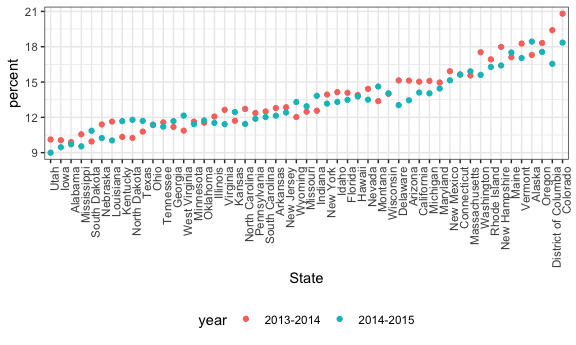
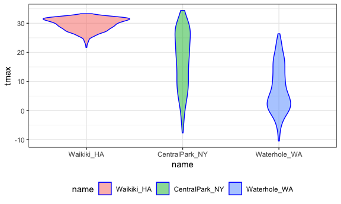
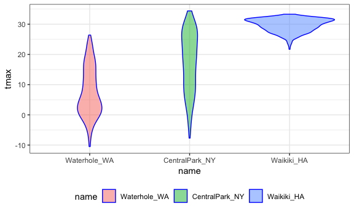
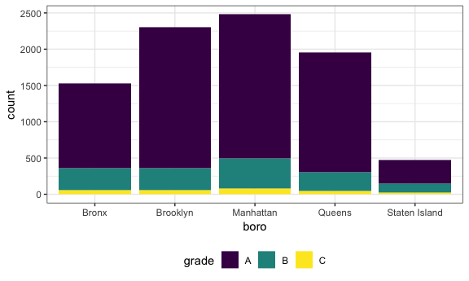
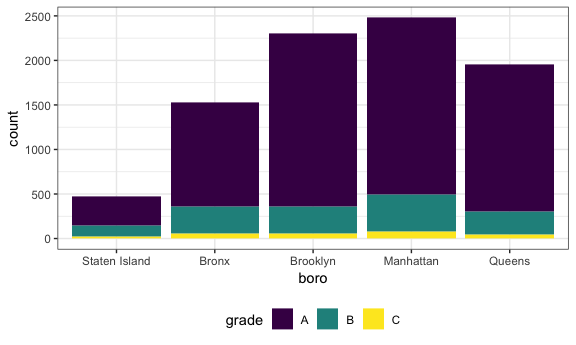
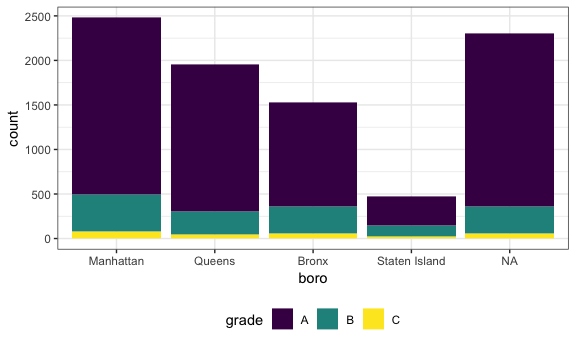
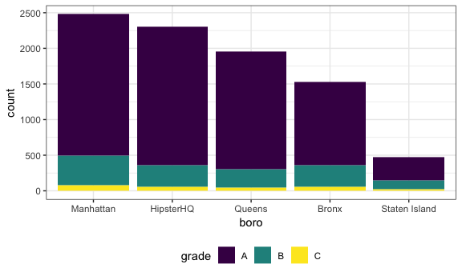

reading\_data\_from\_the\_web
================
Diana Ballesteros Gonzalez
10/11/2018

``` r
knitr::opts_chunk$set(echo = TRUE)

library(tidyverse)
```

    ## ── Attaching packages ────────────────────────────────────────────────────────────────── tidyverse 1.2.1 ──

    ## ✔ ggplot2 3.0.0     ✔ purrr   0.2.5
    ## ✔ tibble  1.4.2     ✔ dplyr   0.7.6
    ## ✔ tidyr   0.8.1     ✔ stringr 1.3.1
    ## ✔ readr   1.1.1     ✔ forcats 0.3.0

    ## ── Conflicts ───────────────────────────────────────────────────────────────────── tidyverse_conflicts() ──
    ## ✖ dplyr::filter() masks stats::filter()
    ## ✖ dplyr::lag()    masks stats::lag()

``` r
library(p8105.datasets)
library(rvest)
```

    ## Loading required package: xml2

    ## 
    ## Attaching package: 'rvest'

    ## The following object is masked from 'package:purrr':
    ## 
    ##     pluck

    ## The following object is masked from 'package:readr':
    ## 
    ##     guess_encoding

``` r
knitr::opts_chunk$set(
  fig.width = 6,
  fig.asp = .6,
  out.width = "90%"
)

theme_set(theme_bw() + theme(legend.position = "bottom"))
```

### Regex

``` r
string_vec = c("my", "name", "is", "jeff")

## Detect will scan through the string vector to look for the pattern 
str_detect(string_vec, "jeff")
```

    ## [1] FALSE FALSE FALSE  TRUE

``` r
## Will scan trhough and replace it if it finds it 
str_replace(string_vec, "jeff", "Jeff")
```

    ## [1] "my"   "name" "is"   "Jeff"

``` r
string_vec = c(
  "i think we all rule for participating",
  "i think i have been caught",
  "i think this will be quite fun actually",
  "it will be fun, i think"
  )

## If it starts with I think 
str_detect(string_vec, "^i think")
```

    ## [1]  TRUE  TRUE  TRUE FALSE

``` r
## If it ends with I think 
str_detect(string_vec, "i think$")
```

    ## [1] FALSE FALSE FALSE  TRUE

``` r
string_vec = c(
  "Y'all remember Pres. HW Bush?",
  "I saw a green bush",
  "BBQ and Bushwalking at Molonglo Gorge",
  "BUSH!!"
  )

## You are able to detect capital and lowercase B 
str_detect(string_vec,"[Bb]ush")
```

    ## [1]  TRUE  TRUE  TRUE FALSE

``` r
string_vec = c(
  '7th inning stretch',
  '1st half soon to begin. Texas won the toss.',
  'she is 5 feet 4 inches tall',
  '3AM - cant sleep :('
  )

## You can get a range of numbers and combine with a letter 
str_detect(string_vec, "^[0-9][a-zA-Z]")
```

    ## [1]  TRUE  TRUE FALSE  TRUE

``` r
string_vec = c(
  'Its 7:11 in the evening',
  'want to go to 7-11?',
  'my flight is AA711',
  'NetBios: scanning ip 203.167.114.66'
  )

## Scan the number 7 followed by anything then 11, the dot allows you to do that 
str_detect(string_vec, "7.11")
```

    ## [1]  TRUE  TRUE FALSE  TRUE

``` r
## Some characters are “special”. These include [ and ], ( and ), and .. If you want to search for these, you have to indicate they’re special using \. Unfortunately, \ is also special, so things get weird.

string_vec = c(
  'The CI is [2, 5]',
  ':-]',
  ':-[',
  'I found the answer on pages [6-7]'
  )

str_detect(string_vec, "\\[")
```

    ## [1]  TRUE FALSE  TRUE  TRUE

### Pulse Data

Tidy the pulse data set!

``` r
pulse_data = haven::read_sas("./data/public_pulse_data.sas7bdat") %>%
  janitor::clean_names() %>%
  gather(key = visit, value = bdi, bdi_score_bl:bdi_score_12m) %>%
  mutate(visit = str_replace(visit, "bdi_score_", ""),
         visit = str_replace(visit, "bl", "00m"),
         visit = fct_relevel(visit, str_c(c("00", "01", "06", "12"), "m"))) %>%
  arrange(id, visit)
```

    ## Warning: attributes are not identical across measure variables;
    ## they will be dropped

``` r
print(pulse_data, n = 12)
```

    ## # A tibble: 4,348 x 5
    ##       id   age sex   visit   bdi
    ##    <dbl> <dbl> <chr> <fct> <dbl>
    ##  1 10003  48.0 male  00m       7
    ##  2 10003  48.0 male  01m       1
    ##  3 10003  48.0 male  06m       2
    ##  4 10003  48.0 male  12m       0
    ##  5 10015  72.5 male  00m       6
    ##  6 10015  72.5 male  01m      NA
    ##  7 10015  72.5 male  06m      NA
    ##  8 10015  72.5 male  12m      NA
    ##  9 10022  58.5 male  00m      14
    ## 10 10022  58.5 male  01m       3
    ## 11 10022  58.5 male  06m       8
    ## 12 10022  58.5 male  12m      NA
    ## # ... with 4,336 more rows

Clean up the imported data...

### NSDUH

``` r
url = "http://samhda.s3-us-gov-west-1.amazonaws.com/s3fs-public/field-uploads/2k15StateFiles/NSDUHsaeShortTermCHG2015.htm"
drug_use_xml = read_html(url)

table_marj = (drug_use_xml %>% html_nodes(css = "table")) %>% 
  .[[1]] %>%
  html_table() %>%
  slice(-1) %>%
  as_tibble()
```

``` r
data_marj = 
  table_marj %>%
  select(-contains("P Value")) %>%
  gather(key = key, value = percent, -State) %>%
  separate(key, into = c("age", "year"), sep = "\\(") %>%
  mutate(year = str_replace(year, "\\)", ""),
         percent = str_replace(percent, "[a-c]$", ""),
         percent = as.numeric(percent)) %>%
  filter(!(State %in% c("Total U.S.", "Northeast", "Midwest", "South", "West")))
```

Now that we have tidy data, we can make some plots...

``` r
## Automatically will order the x-axis by alphabetical order 
data_marj %>%
  filter(age == "12-17") %>% 
  mutate(State = fct_reorder(State, percent)) %>% 
  ggplot(aes(x = State, y = percent, color = year)) + 
    geom_point() + 
    theme(axis.text.x = element_text(angle = 90, hjust = 1))
```



### Tooth brush reviews

``` r
url_base = "https://www.amazon.com/product-reviews/B00005JNBQ/ref=cm_cr_arp_d_viewopt_rvwer?ie=UTF8&reviewerType=avp_only_reviews&sortBy=recent&pageNumber="

## Gives you the reviews from pages 1 through 5 
urls = str_c(url_base, 1:5)

read_html(urls[1]) %>% 
  html_nodes("#cm_cr-review_list .review-title") %>%
  html_text()
```

    ##  [1] "Great Movie"                                       
    ##  [2] "True to life!"                                     
    ##  [3] "Classic family friendly comedy kids can relate to!"
    ##  [4] "Great \"Odd Ball\" movie to watch"                 
    ##  [5] "Nostalgic Stupidity"                               
    ##  [6] "Happy"                                             
    ##  [7] "Go watch THE ROCK or dumb & dumber instead"        
    ##  [8] "My mom loves it"                                   
    ##  [9] "Nothing Quite Like It."                            
    ## [10] "Has pretty sweet bow skills."

``` r
read_html(urls[2]) %>% 
  html_nodes("#cm_cr-review_list .review-title") %>%
  html_text()
```

    ##  [1] "Great"                                           
    ##  [2] "Fast delivery"                                   
    ##  [3] "Lol"                                             
    ##  [4] "Vote For Pedro"                                  
    ##  [5] "So funny!"                                       
    ##  [6] "Great move"                                      
    ##  [7] "Refund needed. Did not pay through Amazon prime."
    ##  [8] "Need a laugh?"                                   
    ##  [9] "The greatest!"                                   
    ## [10] "Five Stars"

### Factors...

this gets confusing: Factors: what you see is not what you get Alphabetical is what you get from string to numeric

``` r
vec_sex = factor(c("male", "male", "female", "female"))
as.numeric(vec_sex)
```

    ## [1] 2 2 1 1

``` r
vec_sex = relevel(vec_sex, ref = "male")
vec_sex
```

    ## [1] male   male   female female
    ## Levels: male female

``` r
as.numeric(vec_sex)
```

    ## [1] 1 1 2 2

Weather Data
------------

``` r
weather_df = 
  rnoaa::meteo_pull_monitors(c("USW00094728", "USC00519397", "USS0023B17S"),
                      var = c("PRCP", "TMIN", "TMAX"), 
                      date_min = "2017-01-01",
                      date_max = "2017-12-31") %>%
  mutate(
    name = recode(id, USW00094728 = "CentralPark_NY", 
                      USC00519397 = "Waikiki_HA",
                      USS0023B17S = "Waterhole_WA"),
    tmin = tmin / 10,
    tmax = tmax / 10) %>%
  select(name, id, everything())
weather_df
```

    ## # A tibble: 1,095 x 6
    ##    name           id          date        prcp  tmax  tmin
    ##    <chr>          <chr>       <date>     <dbl> <dbl> <dbl>
    ##  1 CentralPark_NY USW00094728 2017-01-01     0   8.9   4.4
    ##  2 CentralPark_NY USW00094728 2017-01-02    53   5     2.8
    ##  3 CentralPark_NY USW00094728 2017-01-03   147   6.1   3.9
    ##  4 CentralPark_NY USW00094728 2017-01-04     0  11.1   1.1
    ##  5 CentralPark_NY USW00094728 2017-01-05     0   1.1  -2.7
    ##  6 CentralPark_NY USW00094728 2017-01-06    13   0.6  -3.8
    ##  7 CentralPark_NY USW00094728 2017-01-07    81  -3.2  -6.6
    ##  8 CentralPark_NY USW00094728 2017-01-08     0  -3.8  -8.8
    ##  9 CentralPark_NY USW00094728 2017-01-09     0  -4.9  -9.9
    ## 10 CentralPark_NY USW00094728 2017-01-10     0   7.8  -6  
    ## # ... with 1,085 more rows

``` r
weather_df %>% 
  mutate(name = factor(name)) 
```

    ## # A tibble: 1,095 x 6
    ##    name           id          date        prcp  tmax  tmin
    ##    <fct>          <chr>       <date>     <dbl> <dbl> <dbl>
    ##  1 CentralPark_NY USW00094728 2017-01-01     0   8.9   4.4
    ##  2 CentralPark_NY USW00094728 2017-01-02    53   5     2.8
    ##  3 CentralPark_NY USW00094728 2017-01-03   147   6.1   3.9
    ##  4 CentralPark_NY USW00094728 2017-01-04     0  11.1   1.1
    ##  5 CentralPark_NY USW00094728 2017-01-05     0   1.1  -2.7
    ##  6 CentralPark_NY USW00094728 2017-01-06    13   0.6  -3.8
    ##  7 CentralPark_NY USW00094728 2017-01-07    81  -3.2  -6.6
    ##  8 CentralPark_NY USW00094728 2017-01-08     0  -3.8  -8.8
    ##  9 CentralPark_NY USW00094728 2017-01-09     0  -4.9  -9.9
    ## 10 CentralPark_NY USW00094728 2017-01-10     0   7.8  -6  
    ## # ... with 1,085 more rows

``` r
  ## %>% pull(name) allows you to pull out those names 
```

``` r
## Factor relevel 
weather_df %>%
  mutate(name = forcats::fct_relevel(name, c("Waikiki_HA", "CentralPark_NY", "Waterhole_WA"))) %>% 
  ggplot(aes(x = name, y = tmax)) + 
  geom_violin(aes(fill = name), color = "blue", alpha = .5) + 
  theme(legend.position = "bottom")
```

    ## Warning: Removed 3 rows containing non-finite values (stat_ydensity).



``` r
## Factor reorder 
weather_df %>%
  mutate(name = forcats::fct_reorder(name, tmax)) %>% 
  ggplot(aes(x = name, y = tmax)) + 
  geom_violin(aes(fill = name), color = "blue", alpha = .5) + 
  theme(legend.position = "bottom")
```

    ## Warning: Removed 3 rows containing non-finite values (stat_ydensity).



``` r
weather_df %>%
  lm(tmax ~ name, data = .)
```

    ## 
    ## Call:
    ## lm(formula = tmax ~ name, data = .)
    ## 
    ## Coefficients:
    ##      (Intercept)    nameWaikiki_HA  nameWaterhole_WA  
    ##           17.366            12.291            -9.884

``` r
weather_df %>%
  mutate(name = forcats::fct_relevel(name, c("Waikiki_HA", "CentralPark_NY", "Waterhole_WA"))) %>% 
  lm(tmax ~ name, data = .)
```

    ## 
    ## Call:
    ## lm(formula = tmax ~ name, data = .)
    ## 
    ## Coefficients:
    ##        (Intercept)  nameCentralPark_NY    nameWaterhole_WA  
    ##              29.66              -12.29              -22.18

### Restaurant Inspections

``` r
data(rest_inspec)

rest_inspec %>% 
  group_by(boro, grade) %>% 
  summarize(n = n()) %>% 
  spread(key = grade, value = n)
```

    ## # A tibble: 6 x 8
    ## # Groups:   boro [6]
    ##   boro              A     B     C `Not Yet Graded`     P     Z `<NA>`
    ##   <chr>         <int> <int> <int>            <int> <int> <int>  <int>
    ## 1 BRONX         13688  2801   701              200   163   351  16833
    ## 2 BROOKLYN      37449  6651  1684              702   416   977  51930
    ## 3 MANHATTAN     61608 10532  2689              765   508  1237  80615
    ## 4 Missing           4    NA    NA               NA    NA    NA     13
    ## 5 QUEENS        35952  6492  1593              604   331   913  45816
    ## 6 STATEN ISLAND  5215   933   207               85    47   149   6730

Make my life easy by filtering!!

``` r
rest_inspec =
  rest_inspec %>%
  filter(grade %in% c("A", "B", "C"), boro != "Missing") %>% 
  mutate(boro = str_to_title(boro))
```

Pizza places

``` r
## Looking ofr capital P in Pizza 
rest_inspec %>% 
  filter(str_detect(dba, "Pizza")) %>% 
  group_by(boro, grade) %>% 
  summarize(n = n()) %>% 
  spread(key = grade, value = n)
```

    ## # A tibble: 5 x 3
    ## # Groups:   boro [5]
    ##   boro              A     B
    ##   <chr>         <int> <int>
    ## 1 Bronx             9     3
    ## 2 Brooklyn          6    NA
    ## 3 Manhattan        26     8
    ## 4 Queens           17    NA
    ## 5 Staten Island     5    NA

ˆ

``` r
## Any version of pizza 
rest_inspec %>% 
  filter(str_detect(dba, "[Pp][Ii][Zz][Zz][Aa]")) %>% 
  group_by(boro, grade) %>% 
  summarize(n = n()) %>% 
  spread(key = grade, value = n)
```

    ## # A tibble: 5 x 4
    ## # Groups:   boro [5]
    ##   boro              A     B     C
    ##   <chr>         <int> <int> <int>
    ## 1 Bronx          1170   305    56
    ## 2 Brooklyn       1948   296    61
    ## 3 Manhattan      1983   420    76
    ## 4 Queens         1647   259    48
    ## 5 Staten Island   323   127    21

``` r
library(viridis)
```

    ## Loading required package: viridisLite

``` r
rest_inspec %>% 
  filter(str_detect(dba, "[Pp][Ii][Zz][Zz][Aa]")) %>%
  ggplot(aes(x = boro, fill = grade)) + 
  geom_bar() + 
  scale_fill_viridis(discrete = TRUE)
```



Reorder...

``` r
## infreq tells you the order in which they appear 
rest_inspec %>% 
  filter(str_detect(dba, "[Pp][Ii][Zz][Zz][Aa]")) %>%
  mutate(boro = fct_infreq(boro)) %>%
  ggplot(aes(x = boro, fill = grade)) + 
  geom_bar() + 
  scale_fill_viridis(discrete = TRUE)
```


Relevel with Staten Island First

``` r
rest_inspec %>% 
  filter(str_detect(dba, "[Pp][Ii][Zz][Zz][Aa]")) %>%
  mutate(boro = fct_relevel(boro, "Staten Island")) %>%
  ggplot(aes(x = boro, fill = grade)) + 
  geom_bar() + 
  scale_fill_viridis(discrete = TRUE)
```



``` r
rest_inspec %>% 
  filter(str_detect(dba, "[Pp][Ii][Zz][Zz][Aa]")) %>%
  mutate(boro = fct_infreq(boro),
         boro = replace(boro, which(boro == "Brooklyn"), "HipsterHQ")) %>%
  ggplot(aes(x = boro, fill = grade)) + 
  geom_bar() + 
  scale_fill_viridis(discrete = TRUE)
```

    ## Warning in `[<-.factor`(`*tmp*`, list, value = "HipsterHQ"): invalid factor
    ## level, NA generated



Really change factor value...recode instead of replace

``` r
rest_inspec %>% 
  filter(str_detect(dba, regex("pizza", ignore_case = TRUE))) %>%
  mutate(boro = fct_infreq(boro),
         boro = fct_recode(boro, "HipsterHQ" = "Brooklyn")) %>%
  ggplot(aes(x = boro, fill = grade)) + 
  geom_bar() + 
  scale_fill_viridis(discrete = TRUE)
```



Look them up because there are a lot of other cool functions: - stringr packages - forcats packages

We have the forcats package the string package

recode vs replace recode = replace =

Midterm notes: - Less structured than HW - Submit a report and based on the tools we have learned - Use a git repository - Private repository - Apply for the academic version and that is free - Put data in the .dataignore file
