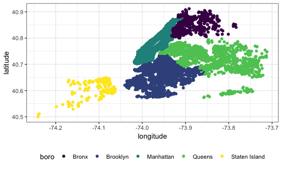

What is DS 2
================
Diana Ballesteros Gonzalez
10/9/2018

Load Dataset
------------

``` r
library(p8105.datasets)
data(nyc_airbnb)

nyc_airbnb
```

    ## # A tibble: 40,753 x 17
    ##        id review_scores_l… name  host_id host_name neighbourhood_g…
    ##     <int>            <int> <chr>   <int> <chr>     <chr>           
    ##  1 7.95e6               10 City…  1.19e5 Linda & … Bronx           
    ##  2 1.60e7               NA WATE…  9.12e6 Collins   Bronx           
    ##  3 1.89e6               NA Quai…  9.82e6 Steve     Bronx           
    ##  4 6.63e6               10 Larg…  1.39e7 Arlene    Bronx           
    ##  5 5.56e6               10 Quai…  2.88e7 Phoebe    Bronx           
    ##  6 9.15e6               10 Cozy…  4.03e5 Diane     Bronx           
    ##  7 1.17e7               10 Cozy…  5.67e7 Josue     Bronx           
    ##  8 7.15e5                9 2 Be…  3.68e6 Enrique   Bronx           
    ##  9 1.79e7               10 Spac…  1.13e7 Yahaira   Bronx           
    ## 10 1.82e5                9 PRIV…  8.73e5 Christia… Bronx           
    ## # ... with 40,743 more rows, and 11 more variables: neighbourhood <chr>,
    ## #   latitude <dbl>, longitude <dbl>, room_type <chr>, price <int>,
    ## #   minimum_nights <int>, number_of_reviews <int>, last_review <date>,
    ## #   reviews_per_month <dbl>, calculated_host_listings_count <int>,
    ## #   availability_365 <int>

Rename/Clean some thing
-----------------------

``` r
nyc_airbnb = 
  nyc_airbnb %>% 
  mutate(stars = review_scores_location / 2) %>% 
  rename(boro = neighbourhood_group)
```

``` r
nyc_airbnb %>% 
  count(boro)
```

    ## # A tibble: 5 x 2
    ##   boro              n
    ##   <chr>         <int>
    ## 1 Bronx           649
    ## 2 Brooklyn      16810
    ## 3 Manhattan     19212
    ## 4 Queens         3821
    ## 5 Staten Island   261

``` r
## View allows you to view in a new tab
nyc_airbnb %>% 
  count(boro, neighbourhood) 
```

    ## # A tibble: 217 x 3
    ##    boro  neighbourhood         n
    ##    <chr> <chr>             <int>
    ##  1 Bronx Allerton             23
    ##  2 Bronx Baychester            6
    ##  3 Bronx Belmont               8
    ##  4 Bronx Bronxdale            12
    ##  5 Bronx Castle Hill           1
    ##  6 Bronx City Island           7
    ##  7 Bronx Claremont Village     9
    ##  8 Bronx Clason Point         21
    ##  9 Bronx Co-op City            5
    ## 10 Bronx Concourse            37
    ## # ... with 207 more rows

Some questions
--------------

-   Does rating vary by niehgborhood, room type, or both?
-   Hos is price related to other variables?
-   Where are rentals located?
-   What is the most expernsive area? What about the least?
-   Which listing has the most unfilled days?
-   Which are has the highest density of listings?
-   What are some host characteristics? How many listings? What's associated with ratings?

``` r
nyc_airbnb %>% 
  group_by(neighbourhood) %>% 
  summarize(mean_rating_neighborhood = mean(stars, na.rm = TRUE)) %>% 
  arrange(desc(mean_rating_neighborhood))
```

    ## # A tibble: 217 x 2
    ##    neighbourhood mean_rating_neighborhood
    ##    <chr>                            <dbl>
    ##  1 Belle Harbor                         5
    ##  2 Bergen Beach                         5
    ##  3 City Island                          5
    ##  4 Dongan Hills                         5
    ##  5 Douglaston                           5
    ##  6 Edenwald                             5
    ##  7 Eltingville                          5
    ##  8 Hollis Hills                         5
    ##  9 Huguenot                             5
    ## 10 Morris Park                          5
    ## # ... with 207 more rows

``` r
nyc_airbnb %>% 
  group_by(room_type) %>% 
  summarize(mean_rating_room_type = mean(stars, na.rm = TRUE)) %>% 
  arrange(mean_rating_room_type)
```

    ## # A tibble: 3 x 2
    ##   room_type       mean_rating_room_type
    ##   <chr>                           <dbl>
    ## 1 Shared room                      4.65
    ## 2 Private room                     4.67
    ## 3 Entire home/apt                  4.75

``` r
nyc_airbnb %>% 
  group_by(neighbourhood, room_type) %>% 
  summarize(mean_rating = mean(stars, na.rm = TRUE), sd(stars, na.rm = TRUE)) %>% 
  arrange(desc(neighbourhood)) 
```

    ## # A tibble: 523 x 4
    ## # Groups:   neighbourhood [217]
    ##    neighbourhood   room_type       mean_rating `sd(stars, na.rm = TRUE)`
    ##    <chr>           <chr>                 <dbl>                     <dbl>
    ##  1 Woodside        Entire home/apt        4.69                     0.308
    ##  2 Woodside        Private room           4.61                     0.367
    ##  3 Woodside        Shared room            4.78                     0.264
    ##  4 Woodrow         Entire home/apt      NaN                      NaN    
    ##  5 Woodlawn        Entire home/apt        4.75                     0.354
    ##  6 Woodlawn        Private room           4.67                     0.577
    ##  7 Woodhaven       Entire home/apt        4.62                     0.25 
    ##  8 Woodhaven       Private room           4.52                     0.360
    ##  9 Woodhaven       Shared room            4.5                     NA    
    ## 10 Windsor Terrace Entire home/apt        4.82                     0.270
    ## # ... with 513 more rows

How is price related to other variables?
----------------------------------------

``` r
nyc_airbnb %>% 
  group_by(neighbourhood) %>% 
  summarize(mean_price = mean(price, na.rm = TRUE)) %>% 
  arrange(desc(mean_price))
```

    ## # A tibble: 217 x 2
    ##    neighbourhood     mean_price
    ##    <chr>                  <dbl>
    ##  1 Westerleigh             785 
    ##  2 Mill Basin              500 
    ##  3 Woodrow                 458.
    ##  4 Tribeca                 353.
    ##  5 Randall Manor           345.
    ##  6 Flatiron District       319.
    ##  7 NoHo                    302.
    ##  8 Sea Gate                288.
    ##  9 Hollis Hills            265 
    ## 10 Greenwich Village       258.
    ## # ... with 207 more rows

``` r
nyc_airbnb %>% 
  group_by(boro, room_type) %>% 
  summarize(mean_price = mean(price, na.rm = TRUE)) %>% 
  arrange(desc(mean_price)) 
```

    ## # A tibble: 15 x 3
    ## # Groups:   boro [5]
    ##    boro          room_type       mean_price
    ##    <chr>         <chr>                <dbl>
    ##  1 Manhattan     Entire home/apt      238. 
    ##  2 Staten Island Entire home/apt      207. 
    ##  3 Brooklyn      Entire home/apt      175. 
    ##  4 Queens        Entire home/apt      140. 
    ##  5 Bronx         Entire home/apt      125. 
    ##  6 Manhattan     Private room         107. 
    ##  7 Manhattan     Shared room           84.7
    ##  8 Brooklyn      Private room          76.7
    ##  9 Queens        Private room          70.6
    ## 10 Bronx         Private room          65.5
    ## 11 Staten Island Private room          65.4
    ## 12 Brooklyn      Shared room           59.6
    ## 13 Bronx         Shared room           57.5
    ## 14 Queens        Shared room           49.1
    ## 15 Staten Island Shared room           25

Where are rentals located?
--------------------------

``` r
library(ggridges)
```

    ## 
    ## Attaching package: 'ggridges'

    ## The following object is masked from 'package:ggplot2':
    ## 
    ##     scale_discrete_manual

``` r
library(viridis)
```

    ## Loading required package: viridisLite

``` r
nyc_airbnb %>% 
  ggplot(aes(x = longitude, y = latitude, color = boro)) + 
  geom_point() + 
  scale_color_viridis(discrete = TRUE)
```



``` r
## Top and Bottom 5 neighborhood prices in BK:
nyc_airbnb %>%
 select(boro, neighbourhood, price) %>%
 filter(boro == "Brooklyn"| boro == "Manhattan") %>%
 group_by(neighbourhood) %>%
 summarize(mean_price = mean(price, na.rm = TRUE),
           median_price = median(price, na.rm = TRUE)) %>% 
 top_n(-5) 
```

    ## Selecting by median_price

    ## # A tibble: 7 x 3
    ##   neighbourhood  mean_price median_price
    ##   <chr>               <dbl>        <dbl>
    ## 1 Borough Park        112.            58
    ## 2 Brownsville          71.8           62
    ## 3 Bushwick             83.2           65
    ## 4 Cypress Hills        69.3           60
    ## 5 Gravesend            85.0           65
    ## 6 Midwood              86.9           65
    ## 7 Sheepshead Bay      168.            58

``` r
## =5 gives you the bottom 5 
nyc_airbnb %>%
 select(boro, neighbourhood, price) %>%
 filter(boro == "Manhattan") %>%
 group_by(neighbourhood) %>%
 summarize(mean_price = mean(price, na.rm = TRUE),
           median_price = median(price, na.rm = TRUE)) %>% 
 top_n(-5) 
```

    ## Selecting by median_price

    ## # A tibble: 5 x 3
    ##   neighbourhood      mean_price median_price
    ##   <chr>                   <dbl>        <dbl>
    ## 1 Harlem                  117.          89  
    ## 2 Inwood                   86.5         75  
    ## 3 Marble Hill              83.6         88  
    ## 4 Roosevelt Island        122.          79  
    ## 5 Washington Heights       90.1         70.5

``` r
nyc_airbnb %>%
 select(boro, neighbourhood, price) %>%
 filter(boro == "Brooklyn") %>%
 group_by(neighbourhood) %>%
 summarize(mean_price = mean(price, na.rm = TRUE),
           median_price = median(price, na.rm = TRUE)) %>%
 top_n(-5) 
```

    ## Selecting by median_price

    ## # A tibble: 7 x 3
    ##   neighbourhood  mean_price median_price
    ##   <chr>               <dbl>        <dbl>
    ## 1 Borough Park        112.            58
    ## 2 Brownsville          71.8           62
    ## 3 Bushwick             83.2           65
    ## 4 Cypress Hills        69.3           60
    ## 5 Gravesend            85.0           65
    ## 6 Midwood              86.9           65
    ## 7 Sheepshead Bay      168.            58

Chloropleoth (look it up)
-------------------------
